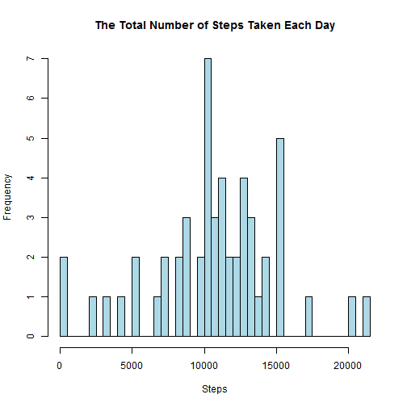
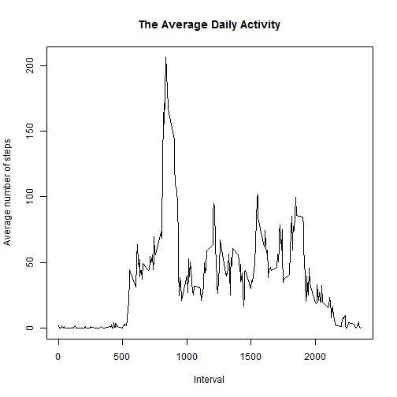
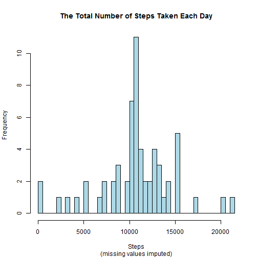
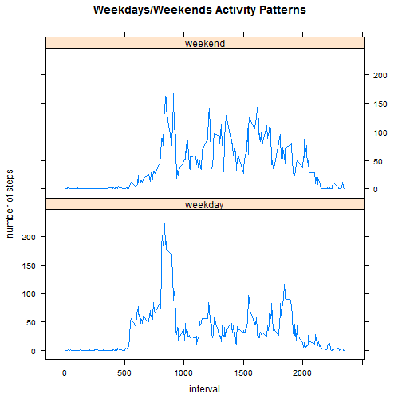

## Loading and preprocessing the data

We unzip and load the data, as well as look at its structure.


```r
unzip("activity.zip")
data <- read.csv("activity.csv", stringsAsFactors = FALSE)
str(data)
```

```
## 'data.frame':	17568 obs. of  3 variables:
##  $ steps   : int  NA NA NA NA NA NA NA NA NA NA ...
##  $ date    : chr  "2012-10-01" "2012-10-01" "2012-10-01" "2012-10-01" ...
##  $ interval: int  0 5 10 15 20 25 30 35 40 45 ...
```

The *date* variable needs to be transformed into convenient POSIXct format.


```r
library(lubridate)
```

```
## Warning: package 'lubridate' was built under R version 3.2.3
```

```r
data$date <- ymd(data$date)
```

## What is mean total number of steps taken per day?

First, we calculate the total number of steps taken each day using *tapply* function. 
The results are presented on the histogram below.


```r
sumsteps <- tapply(data$steps, data$date, sum)
hist(sumsteps, breaks = 50, xlab = "Steps", col = "lightblue",
    main = "The Total Number of Steps Taken Each Day")
```

 

The mean and median total number of steps taken per day is **10766.19** and **10765** accordingly:


```r
meansteps <- mean(sumsteps, na.rm = TRUE)
meansteps
```

```
## [1] 10766.19
```

```r
mediansteps <- median(sumsteps, na.rm = TRUE)
mediansteps
```

```
## [1] 10765
```

## What is the average daily activity pattern?

We make a time series plot of the 5-minute interval (x-axis) and the average number of steps taken, averaged across all days (y-axis). The mean values of all the 288 intervals for each day are calculated with *tapply* function.


```r
meanintervals <- tapply(data$steps, data$interval, mean, na.rm = TRUE)
plot(unique(data$interval), meanintervals, type = "l", xlab = "Interval",
    main = "The Average Daily Activity", ylab = "Average number of steps")
```

 

We can see the peak activity is in the first part of the day. **104th 5-minute interval**, on average across all the days in the dataset, contains the maximum number of steps:


```r
maxinterval <- which.max(meanintervals)
maxinterval
```

```
## 835 
## 104
```

## Imputing missing values

The total number of missing values in the dataset is **2304**.


```r
summissing <- sum(is.na(data$steps))
summissing
```

```
## [1] 2304
```

We can substitute them with mean values of the intervals calculated and stored earlier in *meanintervals* array. For that we first create a new data set equal to the original one:


```r
data_imputed <- data
```

Then, we create a vector of the same length as the *steps* variable by replicating *meanintervals* array (61 replications, one for each day):


```r
ints <- rep(meanintervals, 61)
ints <- as.vector(ints)
```

Now we can fill in the missing values with the corresponding values of *ints* vector:


```r
data_imputed$steps[is.na(data_imputed$steps)] <- ints[is.na(data_imputed$steps)]
sum(is.na(data_imputed))
```

```
## [1] 0
```
As we see, there is no missing values in the new data set. We sum steps taken each day using *data_imputed* dataset. These new adjusted values are presented on the histogram below.
 

```r
sumsteps_imputed <- tapply(data_imputed$steps, data_imputed$date, sum)
hist(sumsteps_imputed, breaks = 50, xlab = "Steps",
             sub = "(missing values imputed)", col = "lightblue",
             main = "The Total Number of Steps Taken Each Day")
```

 

The 2 histograms are similar, though not identical. It means that the missing values imputed with mean estimates had a slight impact on the total number of steps taken on those days.  Let's calculate the adjusted mean and median total number of steps taken per day and compare them to our original estimates.


```r
meansteps_imputed <- mean(sumsteps_imputed)
mediansteps_imputed <- median(sumsteps_imputed)
estimates <- matrix(c(meansteps, meansteps_imputed, mediansteps, 
                            mediansteps_imputed), nrow = 2, byrow = TRUE, 
                          dimnames = list(c("mean", "median"),c("original", "adjusted")))
estimates
```

```
##        original adjusted
## mean   10766.19 10766.19
## median 10765.00 10766.19
```

The adjusted mean and median values are both equal to **10766.19**. The adjusted median value has slightly increased, while the adjusted mean value remains the same.

## Are there differences in activity patterns between weekdays and weekends?

First, we create a new factor variable - *days* - in the new dataset with two levels - "weekday" and "weekend" indicating whether a given date is a weekday or weekend day.


```r
weekdays <- c("Monday", "Tuesday", "Wednesday", "Thursday", "Friday")
data_imputed$days <- factor((weekdays(data_imputed$date)) %in% weekdays, 
                                levels = c(TRUE, FALSE), labels = c("weekday", "weekend"))
```

We calculate mean values for weekday and weekend intervals to make a panel plot: 


```r
subwday <- subset(data_imputed, days == "weekday")
subwend <- subset(data_imputed, days == "weekend")
steps <- c(tapply(subwday$steps, subwday$interval, mean), 
                   tapply(subwend$steps, subwend$interval, mean))
day.type <- c(rep("weekday", 288), rep("weekend", 288))
interval <- c(unique(data_imputed$interval), unique(data_imputed$interval))
panel <- as.data.frame(cbind(steps, interval, day.type), stringsAsFactors = FALSE)
panel$day.type <- factor(panel$day.type, levels = c("weekday", "weekend"))
panel$steps <- as.numeric(panel$steps)
panel$interval <- as.integer(panel$interval)
```

The differences in weekdays/weekends activity patterns are quite striking:


```r
library(lattice)
xyplot(steps ~ interval | day.type, data = panel, type = "l", layout = c(1,2),
               ylab = "number of steps", main = "Weekdays/Weekends Activity Patterns")
```

 


